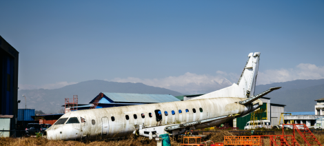
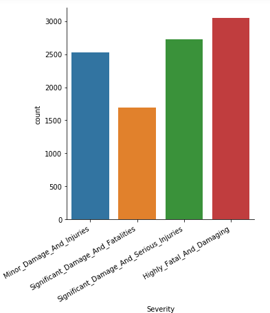

# HackerEarth-Classifying-Airplane-Accidents
 This challenge will encourage you to apply your Machine Learning skills to build models that can anticipate the severity of any airplane accident
 
 # Tools and libraries
 + Python
 + Pandas 
 + Numpy
 + Matplotlib
 + Seaborn 
 + Juypter Notebook
 + Sklearn
 
 
 
  
 i

 
 
 
 

 
 
 # Connect with -  https://www.linkedin.com/in/abhishek-singh-771291170/

